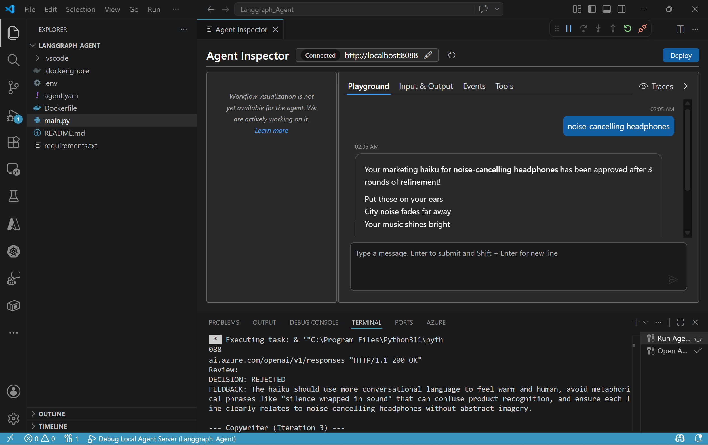

# Microsoft Foundry: LangGraph Workflow as a Hosted Agent (Agents v2)

This repo demonstrates how to build and deploy a **LangGraph-based Workflow** to **Microsoft Foundry Agent Service** using the **Foundry Toolkit for VS Code**. The agent implements a **Marketing Ad Generator** solution: a Copywriter drafts a haiku advertisement for a given product, and a Brand Guardian reviews it against pre-defined rules.

> [!TIP]
> Learn more about Foundry Hosted Agents on the [Microsoft Foundry documentation page](https://learn.microsoft.com/en-us/azure/foundry/agents/concepts/hosted-agents).

---

## 📑 Table of Contents
- [Part 1: Prerequisites](#part-1-prerequisites)
- [Part 2: Environment Setup](#part-2-environment-setup)
- [Part 3: Local Testing](#part-3-local-testing)
- [Part 4: Deploy to Foundry](#part-4-deploy-to-foundry)
- [Part 7: Testing the Deployed Agent](#part-7-testing-the-deployed-agent)

---

## Part 1: Prerequisites

Before getting started, ensure you have:

- **Azure Subscription** with access to provision **Microsoft Foundry**;
- **VS Code** with the **Microsoft Foundry Toolkit** extension installed.

> [!NOTE]
> You don't require Docker Desktop. The VS Code extension pushes Dockerfile to Azure Container Registry to bui;d required Docker image in the cloud.

---

## Part 2: Environment Setup

### 2.1 Microsoft Foundry Setup

Create a Microsoft Foundry **account** and **project**, then deploy a GPT model (e.g., `gpt-4.1-mini`).

### 2.2 RBAC Permissions

The VS Code extension handles most RBAC assignments automatically during deployment, including:

- `AcrPull` on Azure Container Registry for the Foundry managed identity;
- `Azure AI User` on the Foundry project for the agent identity.

### 2.3 Environment Variables

Updated the provided `.env` file in the names of our Foundry account and GPT model's deployment:

``` JSON
AZURE_OPENAI_ENDPOINT=https://<FOUNDRY_ACCOUNT>.openai.azure.com/
AZURE_AI_MODEL_DEPLOYMENT_NAME=<FOUNDRY_MODEL>
```

> [!NOTE]
> This solution uses an **Azure OpenAI endpoint**, not a Microsoft Foundry Project endpoint.

### 2.4 Configure `agent.yaml`

Update the provided `agent.yaml` with your agent name and resource allocation, if required:

``` YAML
kind: hosted
name: 'demo-langgraph-agent'
protocols:
  - protocol: responses
    version: 1.0.0
resources:
  cpu: '0.5'
  memory: '1.0Gi'
environment_variables:
  - name: AZURE_OPENAI_ENDPOINT
    value: ${AZURE_OPENAI_ENDPOINT}
  - name: AZURE_AI_MODEL_DEPLOYMENT_NAME
    value: ${AZURE_AI_MODEL_DEPLOYMENT_NAME}
```

### 2.5 Install Dependencies

Install required Python packages:

``` PowerShell
pip install -r requirements.txt
```

The `requirements.txt` includes:

``` JSON
azure-ai-agentserver-responses==1.0.0b5
azure-identity
openai
python-dotenv
debugpy
langgraph
langchain-openai
```
---

## Part 3: Local Testing

### 3.1 Start the Agent

Press **F5** in VS Code. This runs the agent server locally on `http://localhost:8088` with the debugger attached.

You should see in the terminal:

``` JSON
Executing AITK task: debug-check-prerequisites
Checking port occupancy: 5679, 8088
✓ Port 5679 is available
✓ Port 8088 is available

Task completed successfully.
 *  Terminal will be reused by tasks, press any key to close it. 
 *  Executing task: & '"C:\Program Files\Python311\python.exe"' -m debugpy --listen 127.0.0.1:5679 main.py --port 8088 

2026-05-06 01:52:41,027 INFO azure.ai.agentserver: Responses protocol: storage_provider=InMemoryResponseProvider, default_model=(not set), default_fetch_history_count=20, shutdown_grace_period=10s
2026-05-06 01:52:41,443 INFO azure.ai.agentserver: AgentServerHost starting on 0.0.0.0:8088
2026-05-06 01:52:41,451 INFO azure.ai.agentserver: AgentServerHost started
2026-05-06 01:52:41,451 INFO azure.ai.agentserver: Platform environment: is_hosted=False, agent_name=(not set), agent_version=(not set), port=8088, session_id=(not set), sse_keepalive_interval=disabled
```

### 3.2 Test in Agent Inspector

1. Open the Command Palette (`Ctrl+Shift+P`);
2. Run **AI Toolkit: Open Agent Inspector**;
3. It connects to `http://localhost:8088` automatically;
4. Type a product name, for example: `noise-cancelling headphones`.

The _Copywriter_ agent will draft a haiku, the _Brand Guardian_ agent will review it, and the loop runs until approved. You will see the final approved haiku with the Brand Guardian's sign-off.



---

## Part 4: Deploy to Foundry

### 4.1 Deploy via VS Code

1. Open the Command Palette (`Ctrl+Shift+P`);
2. Run **Microsoft Foundry: Deploy Hosted Agent**;
3. Follow the prompts:
   - Select your **Foundry project**;
   - Select an **Azure Container Registry**;
   - Choose **resource size** (CPU/memory).

### 4.2 Monitor Deployment

Watch the **OUTPUT** panel in VS Code (filter by **Microsoft Foundry**). A successful deployment ends with something like this:

``` JSON
[info] Hosted agent deployment process completed successfully
[info] Found 1 versions for agent: demo-langgraph-agent
```
